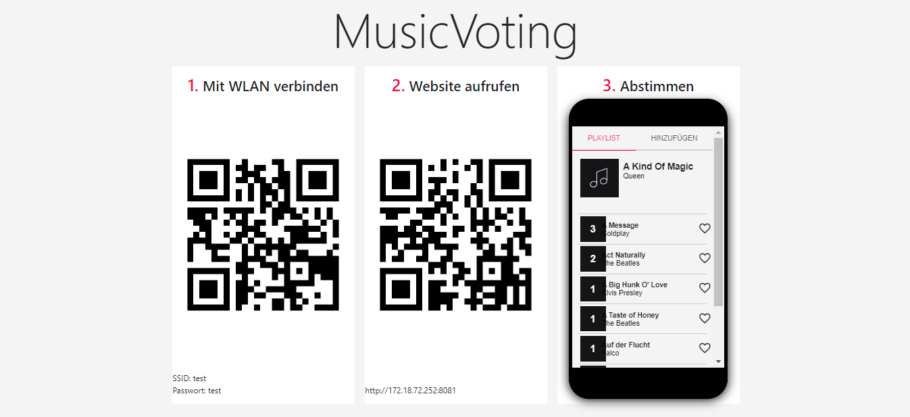
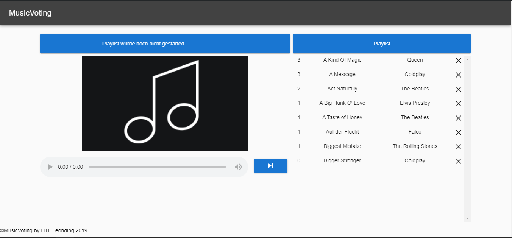
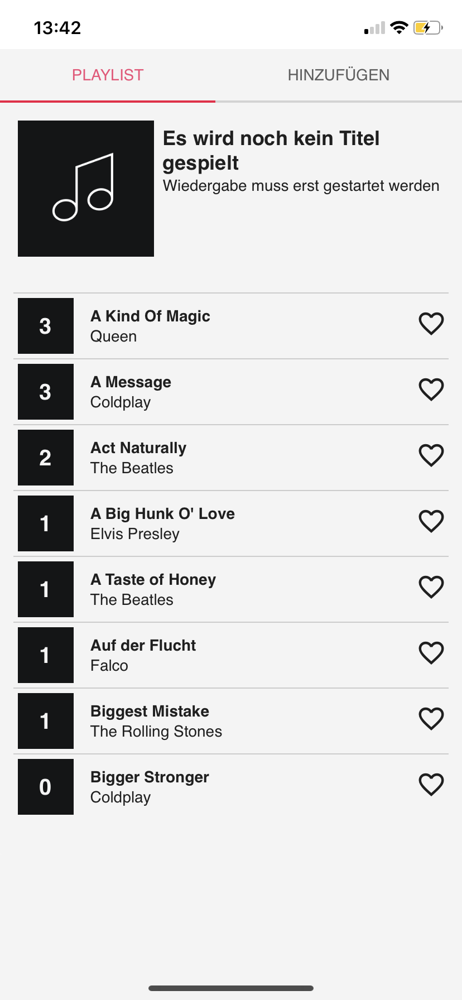

# MusicVoting - Bedienungsanleitung

### 1. Schul-PC ohne Internet booten!

### 2. Repository öffnen

Falls das Repository noch nicht gecloned wurde:
```bash
git clone https://github.com/lengauermario/MusicVote.git
```

Auf dem Schul-PC ist das Repository zu finden ```/home/leonie/Desktop/musicvoting/MusicVote```


### 3. Docker-Netzwerk starten

Für diese Aufgabe existiert bereits ein Shell-Script!

```bash
chmod +x startup.sh
./startup.sh
```

Folgende Eingaben sind erforderlich:

```
ip-address of Server
192.186.1.101 (Beispielswert, ifconfig für eigene IP-Adresse)
```

```
init of database: (true/false)
true (im Normalfall immer true nehmen)
```

```
password for admin:
Grillfest2019 (Passwort für die Abspielseite)
```

```
folder of mp3 files:
/home/leonie/mp3/playlist (Dieser Wert passt für diesen Computer)
```

```
WLAN SSID:
FRITZ!Box
```

```
WLAN password:
0000
```

Nun wird der Server sowie die Client-Projekte gebuildet und in einem Docker-Netzwerk gestartet!


### 4. Webseiten aufrufen

###### Beitrittseite

Um den Gästen einen einfachen Zugang zu MusicVoting zu ermöglichen, steht eine Website unter dem Port 8083 zur Verfügung.




###### Abspielseite

Auf dem Computer, mit dem die Musik abgespielt werden soll, muss die Website auf dem Port 8082 aufgerufen werden.

**Hinweis:**
Unter Firefox kann es Probleme mit dem Abspielen der mp3-Files geben! Mit **Chrome** beispielsweise gibt es keine Probleme




###### Mobile Client

Gäste können auf der Website unter dem Port 8081 für die Musik abstimmen. Auf diese Seite gelangen sie auch mithilfe eines QR-Codes auf der Betrittseite!




