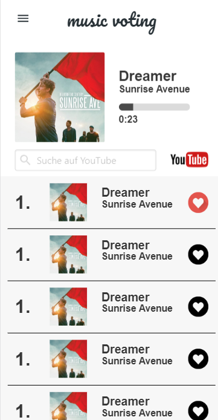

## 🛠 Status: In Development

## :bookmark_tabs: Inhaltsverzeichnis
- [Beschreibung](#beschreibung)
- [Vorschau](#iphone-vorschau)
- [Problembeschreibung](#problembeschreibung)
- [Quickstart](#rocket-quickstart)

# Beschreibung
Was wäre das perfekte System ohne einem modernen aber auch zugleich praktischen Design?
Genau das versuchen wir hier bestmöglichst umzusetzen. Für Feedback sind wir offen.

# :iphone: Vorschau
Dies ist eine aktuelle Vorschau.



# Problembeschreibung
Ich bin auf ein Problem gestoßen, welches ich in Polymer Lit-Element nur sehr umständlich lösen könnte. Dies wäre die Voting Liste in der View aktuell zu halten. Sodass, wenn ein Vote abgegeben wird und sich ein Song um eine Position verschiebt, die Liste in der View synchron zur Liste im Hintergrund bleibt. Dies ist laut meinen Recherchen, nur möglich, wenn man selbst das komplette Listenelement neu renderen würde oder wenn man bei allen Songs die sich verschieben jeweils die Daten neu schreiben würde und diese dann noch in der View aktualisiert. Dies ist jedoch sehr umständlich und im Code nicht mehr leserlich. Daher wäre eine Migration auf Angular, wo dies alles automatisch passiert, die wohl bessere Variante für uns, da wir zu einem späteren Zeitpunkt wo wir Animationen einbauen möchten ebenfalls mehr Möglichkeiten hätten.

Hier zu das Beispiel wo ich einem Song einen Vote gebe. Das Lied verschiebt sich in der Liste jedoch bleibt die View genau gleich obwohl der Song um eines nach oben rutschen müsste.


# :rocket: Quickstart

**Clone Project** <br>
```
git clone https://github.com/lengauermario/MusicVote.git
```
**Install dependencies** <br>
```
npm install
```
**Run the app in development mode** <br>
```
npm start
```
