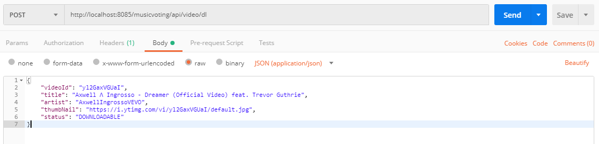
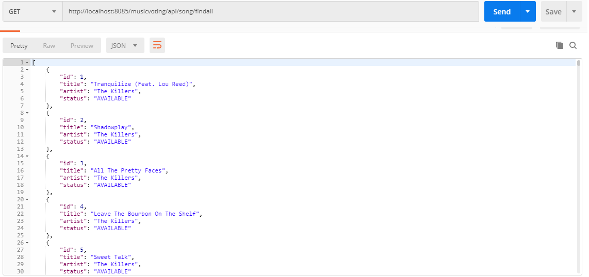
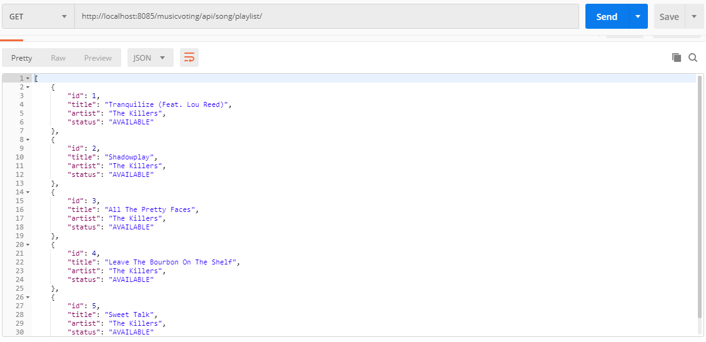
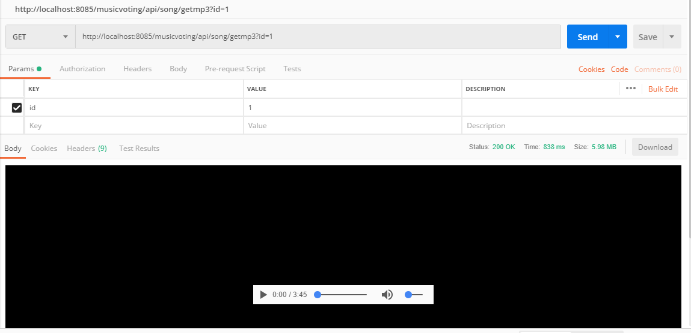

# JakarteEE Server

This is the final project for our server, all the functionality is not split up to the different prototypes anymore. 
All the functionality will be implemented here. 

# Status
The server can already store all the meta data of the local mp3 files in the database, search for Youtube-Videos, Download them and
control a playlist. For all these functions, there are rest endpoint to call them. 

# Getting started
In order to start the server you need to have a Wildfly configured with a Derby datasource called DbDS. You need to have a property file called 
'youtube.properties' in your resource folder with following properties:

```
apikey={YOUR_APIKEY}
```

You also have to have a file called 'config.properties' in the same folder where the following properties can be found:
```
init=true //whether you whant to init your database at startup
startFolder=C:\\ ... //the folder where your mp3 files are
youtubeFolder=C:\\ ... //the folder where you want to store the downloaded youtube videos
```
If you haven't downloaded youtube-dl, have a look [here](https://github.com/lengauermario/MusicVote/tree/master/Youtube-Server-Prototyp)


# Documentation
Youtube Request do work the same as [here](https://github.com/lengauermario/MusicVote/tree/master/Youtube-Server-Prototyp).
For downloading videos you have to pass the ResponseObject you get at the request in the body. 

### Youtube - Requests & Downloads


#### Requests
Youtube Request work almost the same as [here](https://github.com/lengauermario/MusicVote/tree/master/Youtube-Server-Prototyp). The only difference is that there is a status which describes the availablity of that video. If nobody tried to download it, it says: DOWNLOADABLE. If somebody tried to download it, but there was an error during the download, it says: NOT AVAILABLE, so it can't be downloaded. If someone it is currently downloading, it says DOWNLOADING. And if somebody already downloaded it, it's already AVAILABLE and not a Youtube-Video anymore but a mp3 file on the server.
<br />
Example:

<br />
<br />

#### Downloads
If you did a Youtube-Request, you receive 10 "Response Objects". If you want to download a certain video, you have to put the response object of that video in the body of the following request: http://localhost:8085/musicvoting/api/video/dl.
<br />
The server then downloads the video asynchronously and keeps the status of the video up-to-date: If it's still downloading (takes about 9sec) the status will be DOWNLOADING. If it has finished with an error: NOT AVAILABLE, without error: AVAILABLE.
<br />
Example:

<br />
<br />
### Songs

#### Request all songs
Simple GET Request on http://localhost:8085/musicvoting/api/song/findall. It returns all local mp3 files and youtube-videos which ever got tried to download. All songs contain an id, the title, the artist (channel if its a Youtube Video) and a status. The status is AVAILABLE for a local mp3 files. It can be DOWNLOADING for Youtube Videos or NOT AVAILABLE if an error occured during the download.
<br />
Example:

<br />
<br />
#### Request the current playlist
Requesting the current playlist works the same as requesting all songs: 

<br />
<br />
### Handling the Playlist
At the moment there is an endpoint for adding songs to the playlist by the id and voting for them. Since there are options like Websockets or SSE, which we currently do not have implemented, this endpoint is just temporary and will get removed when SSE or Websockets are implemented on this server.

### Request the actual audio of a song
GET request to http://localhost:8085/musicvoting/api/song/getmp3?id={ID} is enough to receive the audio of a song. 
Example:

<br />
<br />
# Creator
Leon Kuchinka
Jonas Schürz (Initialization of database)
