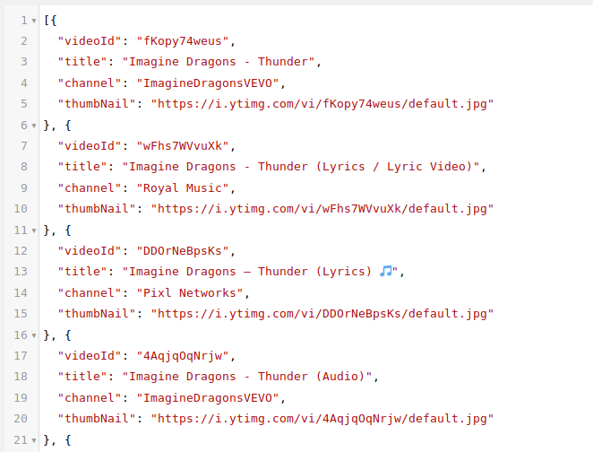

# Youtube-Server-Prototyp

### Getting started
- In order for the Youtube-dl to work you should use Linux
- Install [youtube-dl](https://rg3.github.io/youtube-dl/)
```
sudo curl -L https://yt-dl.org/downloads/latest/youtube-dl -o /usr/local/bin/youtube-dl
sudo chmod a+rx /usr/local/bin/youtube-dl
```
- For problems with converting the youtube-video in a mp3 file please execute the following command
```
sudo apt-get install ffmpeg
```
### Functionality
This Prototype is able to search for YouTube Videos by using the [Youtube API v3](https://developers.google.com/youtube/v3/docs/search/list)
serverside, which means the user no longer has to authorize the request. This JakartaEE-Prototype takes a search pattern (encoded) as a parameter
in the url (/youtubesearch/api/video/[text to search for]). The first response is then downloaded as an mp3 file using youtube-dl and stored
in an specified folder. The only problem is that this mp3 file does not have any mp3-tags which means we do not receive any meta data about it.

### Requests

#### Youtube Request
For a simple Youtube request, you have to send a GET request to http://localhost:8085/youtubesearch/api/video?queryTerm={YOUR_QUERY}. Your query has to be html-path encoded, because blanks, spaces etc. cant be send to the server.

##### Sample Request
A simple request for searching "thunder" in Youtube could look like this:

<br />
<br />
The response would look like this:

<br />
<br />
#### Download Request
For downloading a specific video, send a GET request to http://localhost:8085/youtubesearch/api/video/dl?id={YOUR_ID}.


##### Sample Request
The correct request to download the first video from the example above would look like this:

<br />
<br />
The response would look like this, after the successful download of the video (it takes 9s at the moment)

<br />
<br />
##### Sample Invalid Request
A wrong request (id is not valid) could look like this:

<br />
<br />
For a invalid request, the status code of the response will have 500 (Internal Server Error)

<br />
<br />

### Problems
Unfortunatly it is not possible to request the music-title and artist meta data, because there is no interface in the Youtube-API which returns this data. It is also described [here](https://stackoverflow.com/questions/12448523/get-the-artist-and-song-title-from-youtube-video-by-api).


### Creator
Leon Kuchinka
